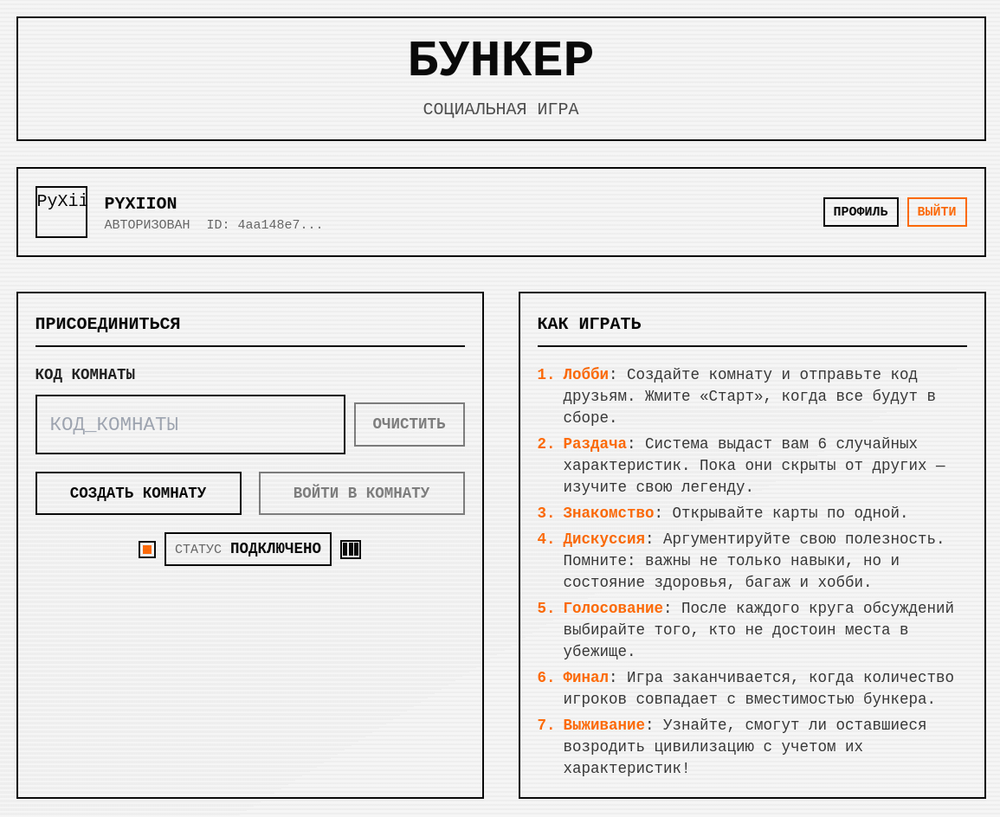
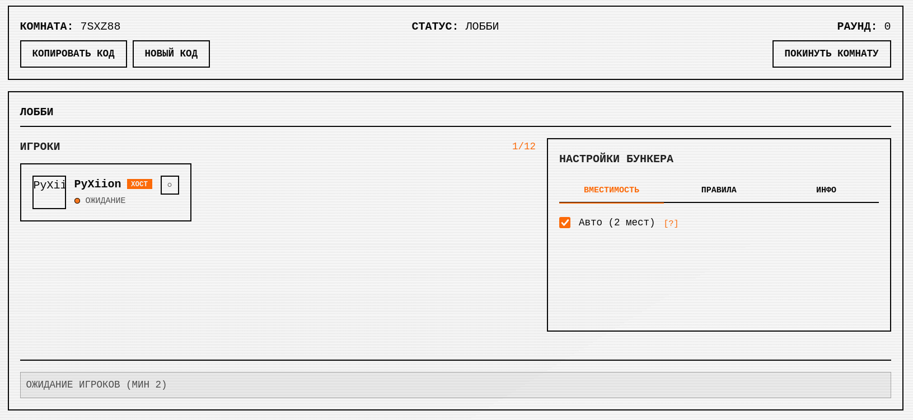
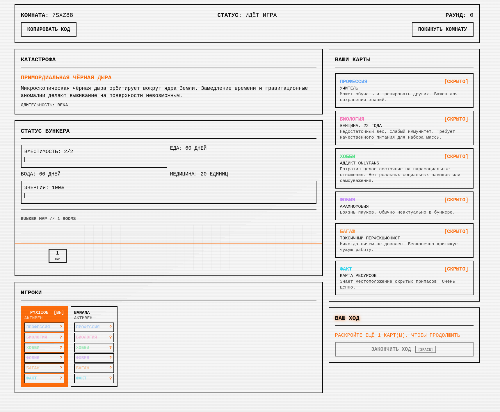
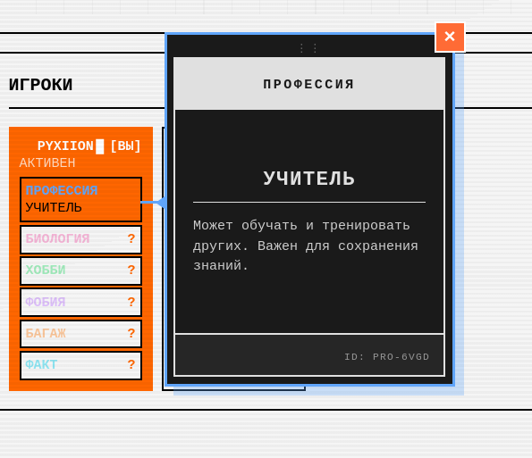
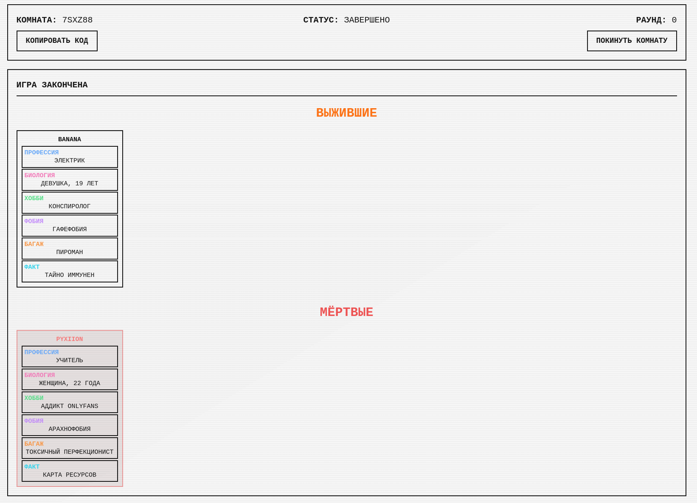

# Bunker 🎭

> ⚠️ **Warning**: This project was vibe coded. Proceed with caution.

A multiplayer social deduction game where players debate their usefulness to survive in a bunker during a catastrophe.

**The premise:** The world is ending. Only a few can survive in the bunker. Each player has hidden trait cards - some useful, some useless. Through discussion and voting, you decide who stays and who gets exiled.

## Play Now

🚀 **Play at [bunker.pyxiion.ru](https://bunker.pyxiion.ru)**

## Tech Stack

- **Frontend**: Nuxt 3 + Vue 3 + TailwindCSS
- **Backend**: Node.js + Express + Socket.io
- **Database**: PostgreSQL + Prisma ORM
- **Auth**: Casdoor (SSO/OIDC)
- **Deployment**: Docker + Docker Compose

## Key Features

- **Real-time multiplayer** with 4-12 players per room
- **100+ profession cards** - from Doctors to NFT Traders
- **20 catastrophe scenarios** - nuclear war, pandemics, zombie outbreaks
- **Guest mode** for quick play, or sign in for persistent stats
- **Full game history** and statistics for registered users
- **English & Russian** language support (English disabled temporarily)

## Screenshots






## Project Structure

```
openbunker/
├── backend/          # Node.js + Socket.io server
├── frontend/         # Nuxt 3 application
├── casdoor/          # SSO configuration
└── docker-compose.yml
```

## Documentation

- **[SETUP.md](SETUP.md)** - Detailed setup guide
- **[ARCHITECTURE.md](ARCHITECTURE.md)** - Socket events, data models, UI specs
- **[CONFIGURATION.md](CONFIGURATION.md)** - Configuration options & environment variables
- **[README-AUTH.md](README-AUTH.md)** - Authentication system details

## License

MIT
